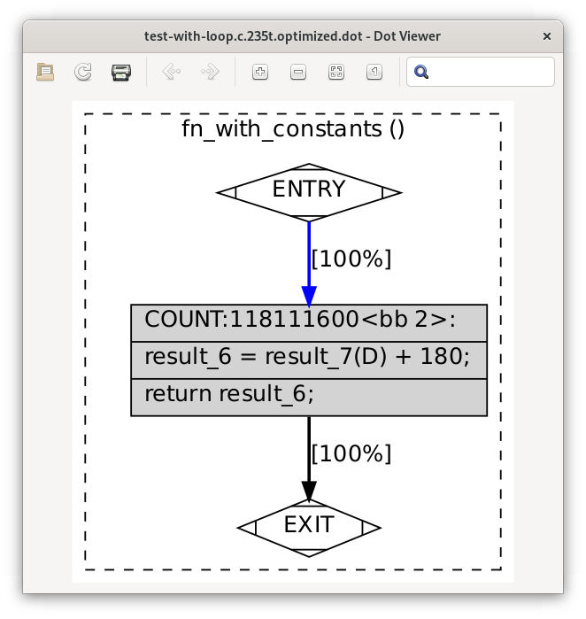
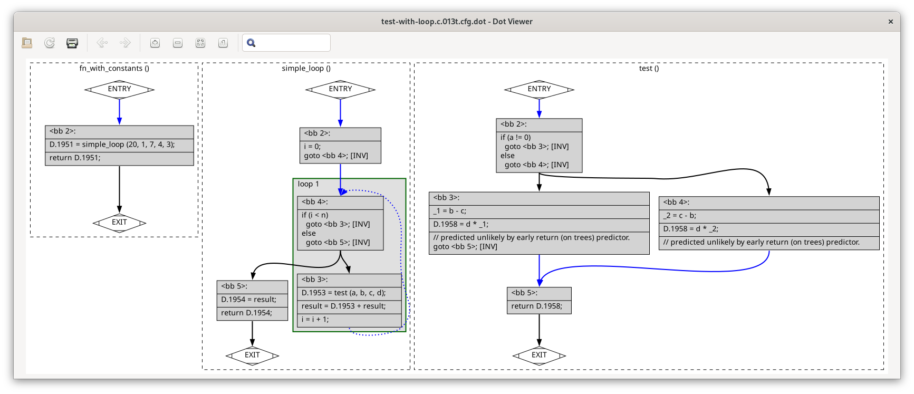

.. Copyright (C) 2016-2024 Free Software Foundation, Inc.
   Originally contributed by David Malcolm <dmalcolm@redhat.com>

   This is free software: you can redistribute it and/or modify it
   under the terms of the GNU General Public License as published by
   the Free Software Foundation, either version 3 of the License, or
   (at your option) any later version.

   This program is distributed in the hope that it will be useful, but
   WITHOUT ANY WARRANTY; without even the implied warranty of
   MERCHANTABILITY or FITNESS FOR A PARTICULAR PURPOSE.  See the GNU
   General Public License for more details.

   You should have received a copy of the GNU General Public License
   along with this program.  If not, see
   <http://www.gnu.org/licenses/>.

Exercise: What did the optimizer do?
====================================

A good exercise is to create some simple C code, let GCC optimize it,
and figure out how the code got optimized.

For example, consider:

.. code-block:: c

  static int test (int a, int b, int c, int d)
  {
    if (a)
      return (b - c) * d;
    else
      return (c - b) * d;
  }
  
  static int simple_loop (int n, int a, int b, int c, int d)
  {
    int result;
    int i;
    for (i = 0; i < n; i++)
      result += test (a, b, c, d);
    return result;
  }
  
  int fn_with_constants (void)
  {
    return simple_loop (20, 1, 7, 4, 3);
  }

If we run gcc on this:

.. code-block:: sh

  gcc -S test-with-loop.c -O2 -fdump-tree-all-graph -fdump-ipa-all-graph -fdump-rtl-all-graph

and look at the generated assembler

:file:`test-with-loop.s`:

.. code-block:: asm
  
  	.file	"test-with-loop.c"
  	.text
  	.p2align 4
  	.globl	fn_with_constants
  	.type	fn_with_constants, @function
  fn_with_constants:
  .LFB2:
  	.cfi_startproc
  	movl	$180, %eax
  	ret
  	.cfi_endproc
  .LFE2:
  	.size	fn_with_constants, .-fn_with_constants
  	.ident	"GCC: (GNU) 10.3.1 20210422 (Red Hat 10.3.1-1)"
  	.section	.note.GNU-stack,"",@progbits
  
  
we see that ``cc1`` has replaced all of our code with a simple ``return 180;``

The static functions have been optimized away.

Try this with your own example.

This is with GCC 10 on x86_64; your results may be different.

At first glance this may seem like magic, but what is happening is that
the various optimization passes simplify the code and these small
simplifications build on each other, eventually leading to the trivial
code seen above.

How does it work?  The way to track this down is to

* follow the instructions on the previous page to dump the state
  of ``cc1`` at each of the various optimization passes.

* do a binary search through the dump files to find the places where
  significant changes happen

A good place to start is to look at the GIMPLE/RTL boundary, where
``optimized`` is the final state of the GIMPLE before it becomes RTL.
For this example, we see that the optimization has already happened,
using the GIMPLE IR:

.. code-block:: c

  ;; Function fn_with_constants (fn_with_constants, funcdef_no=2, decl_uid=1948, cgraph_uid=3, symbol_order=2)
  
  fn_with_constants ()
  {
    int result;
  
    <bb 2> [local count: 118111600]:
    result_6 = result_7(D) + 180;
    return result_6;
  
  }

Compare with the ``original`` (generic tree) representation compiing out
of the C frontend:

.. code-block:: c

  ;; Function test (null)
  ;; enabled by -tree-original
  
  
  {
    if (a != 0)
      {
        return (b - c) * d;
      }
    else
      {
        return (c - b) * d;
      }
  }
  
  
  ;; Function simple_loop (null)
  ;; enabled by -tree-original
  
  
  {
    int result;
    int i;
  
      int result;
      int i;
    i = 0;
    goto <D.1945>;
    <D.1944>:;
    SAVE_EXPR <test (a, b, c, d)>;, result = SAVE_EXPR <test (a, b, c, d)> + result;;
    i++ ;
    <D.1945>:;
    if (i < n) goto <D.1944>; else goto <D.1946>;
    <D.1946>:;
    return result;
  }
  
  
  ;; Function fn_with_constants (null)
  ;; enabled by -tree-original
  
  
  {
    return simple_loop (20, 1, 7, 4, 3);
  }

and, once we have a CFG:

So the above optimizations are happening *somewhere* between ``cfg`` and
``optimized``.  The exact details will vary from GCC release to release, and
figuring it out is a useful exercise, so I'm leaving that to the reader.

You'll want to do a binary search through the dumps.  Note that in many of the
dumps nothing much changes (e.g. the exception-handling pass is unliktly to
do anything to the IR if there are no exceptions), whereas in a few passes,
a lot changes, but exactly what those most useful passes are may vary
depending on what your code is doing.
