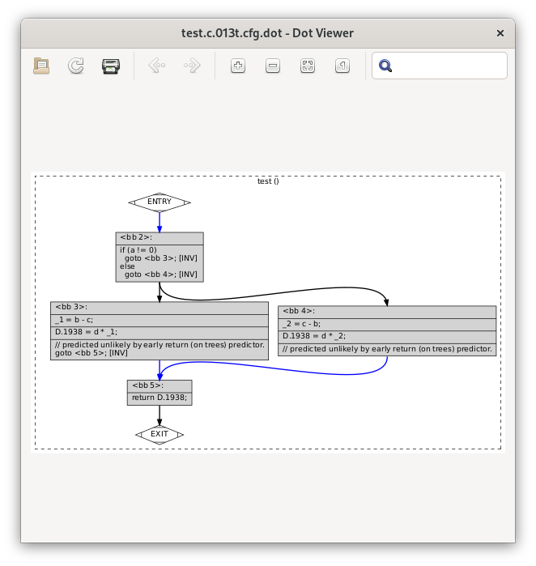
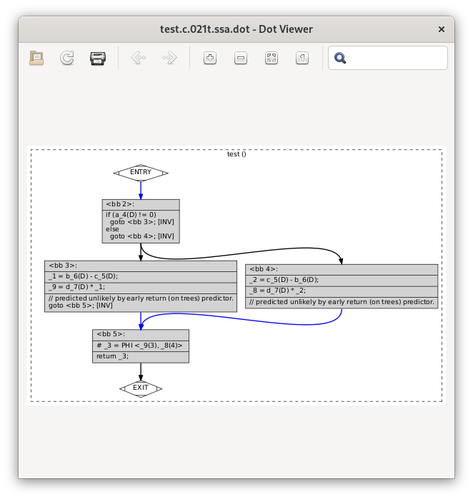
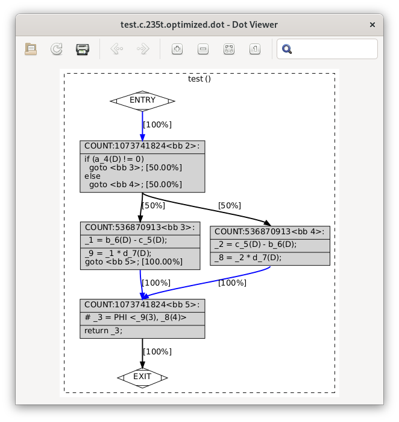
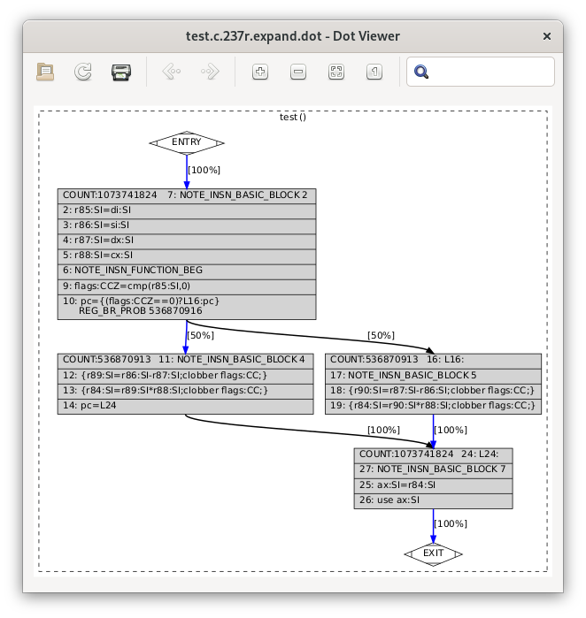

Inside :program:`cc1`
---------------------

GCC is a collection of compilers for different languages, which
can generate code for a wide variety of different CPU architectures.

GCC currently supports 10 source languages, and 55 target CPU
architectures.  We don't want to have to write 550 different compilers,
so, as is common, GCC is structured into three parts:

* source language "front ends" - one for each source language, taking
  the source language as input, using it to generating an "internal
  represention" (IR) of the user's code in a language-independent
  internal format

* target-specific "back ends" - one for each target, taking the internal
  representation as input, and generating assembler for that target

* the so-called "middle end", sitting between these, which optimizes the
  code, so that the back end has better code to work with

So :program:`cc1` built for ``x86_64`` has the C frontend, the shared
optimizing code, and the x86_64 backend::

                  +-----+
                +-| cc1 |--------------------------------------------------+
                | +-----+                                                  |
                |                                                          |
                |  C frontend          Optimizer          x86_64 backend   |
   C source ====+==============>  IR =============> IR  ===================+==> x86_64 asm
                |                                                          |
                +----------------------------------------------------------+

Sadly the above picture is an idealized picture, in that the code is
rather messier than that in practice.  It's also over-simplified, in
that GCC actually has several internal representations, which we'll talk
about in detail below.

* if you're interested in adding new warnings to GCC, you'll probably
  want to just look at the frontends for now, and to merely skim the
  sections below.

* if you want to make GCC generate better code, you'll want to look at
  the middle-end and backends, and find out more about gcc's internal
  representations by reading the section below

* if you're interested in adding support to GCC for a new kind of CPU,
  you'll want to look mostly at the backend/RTL sections below

How does :program:`cc1` turn C into assembler?
**********************************************

When figuring out how the compiler works, it's best to start with a really
simple source file - in particular, one with doesn't ``#include`` any
header files.  Our earlier example used :file:`<stdio.h>`, so let's make
an even simpler :file:`test.c`:

.. code-block:: c

  int test (int a, int b, int c, int d)
  {
    if (a)
      return (b - c) * d;
    else
      return (c - b) * d;
  }

Compiling it to assembler, with some optimization (:option:`-O2`) and
enabling verbose assembler output (:option:`-fverbose-asm`):

.. code-block:: sh

  $ gcc -S test.c -O2 -fverbose-asm

gives this :file:`test.s`:

.. code-block:: asm

          .file   "test.c"
          ; ...omitting dump of options for brevity...
          .text
          .p2align 4
          .globl  test
          .type   test, @function
  test:
  .LFB0:
          .cfi_startproc
  # test.c:2: {
          movl    %ecx, %eax      # tmp97, d
  # test.c:3:   if (a)
          testl   %edi, %edi      # tmp94
          je      .L2     #,
  # test.c:4:     return (b - c) * d;
        subl    %edx, %esi      # c, tmp89
  # test.c:4:     return (b - c) * d;
          imull   %esi, %eax      # tmp89, <retval>
          ret     
          .p2align 4,,10
          .p2align 3
  .L2:
  # test.c:6:     return (c - b) * d;
          subl    %esi, %edx      # b, tmp90
  # test.c:6:     return (c - b) * d;
          imull   %edx, %eax      # tmp90, <retval>
  # test.c:7: }
          ret     
          .cfi_endproc
  .LFE0:
          .size   test, .-test
          .ident  "GCC: (GNU) 10.3.1 20210422 (Red Hat 10.3.1-1)"
          .section        .note.GNU-stack,"",@progbits

where :program:`cc1` has converted the C code into a pair of
subtractions (:code:`subl`), and a pair of multiplies (:code:`imull`)
that populate the ``%eax`` register, used for the return value.

You can see GCC's internal representations using GCC's dump options.  If
we add :option:`-fdump-tree-all -fdump-ipa-all -fdump-rtl-all` to the
above command line, giving:

.. code-block:: sh

  gcc -S test.c -O2 -fverbose-asm -fdump-tree-all -fdump-ipa-all -fdump-rtl-all

then these dump options lead :program:`cc1` to emit *many* dump files
(192 in the following example):

.. code-block:: sh

  $ ls
  test.c                              test.c.101t.alias              test.c.238r.vregs
  test.c.000i.cgraph                  test.c.102t.retslot            test.c.239r.into_cfglayout
  test.c.000i.ipa-clones              test.c.103t.fre3               test.c.240r.jump
  test.c.000i.type-inheritance        test.c.104t.mergephi2          test.c.241r.subreg1
  test.c.004t.original                test.c.105t.thread1            test.c.242r.dfinit
  test.c.005t.gimple                  test.c.106t.vrp1               test.c.243r.cse1
  test.c.007t.omplower                test.c.107t.dce2               test.c.244r.fwprop1
  test.c.008t.lower                   test.c.108t.stdarg             test.c.245r.cprop1
  test.c.011t.eh                      test.c.109t.cdce               test.c.246r.pre
  test.c.013t.cfg                     test.c.110t.cselim             test.c.248r.cprop2
  test.c.015t.ompexp                  test.c.111t.copyprop1          test.c.251r.ce1
  test.c.018i.visibility              test.c.112t.ifcombine          test.c.252r.reginfo
  test.c.019i.build_ssa_passes        test.c.113t.mergephi3          test.c.253r.loop2
  test.c.020t.fixup_cfg1              test.c.114t.phiopt2            test.c.254r.loop2_init
  test.c.021t.ssa                     test.c.115t.tailr2             test.c.255r.loop2_invariant
  test.c.023t.nothrow                 test.c.116t.ch2                test.c.258r.loop2_done
  test.c.024i.opt_local_passes        test.c.117t.cplxlower1         test.c.261r.cprop3
  test.c.025t.fixup_cfg2              test.c.118t.sra                test.c.262r.stv1
  test.c.026t.local-fnsummary1        test.c.119t.thread2            test.c.263r.cse2
  test.c.027t.einline                 test.c.120t.dom2               test.c.264r.dse1
  test.c.028t.early_optimizations     test.c.121t.copyprop2          test.c.265r.fwprop2
  test.c.029t.objsz1                  test.c.122t.isolate-paths      test.c.267r.init-regs
  test.c.030t.ccp1                    test.c.123t.dse2               test.c.268r.ud_dce
  test.c.031t.forwprop1               test.c.124t.reassoc1           test.c.269r.combine
  test.c.032t.ethread                 test.c.125t.dce3               test.c.271r.stv2
  test.c.033t.esra                    test.c.126t.forwprop3          test.c.272r.ce2
  test.c.034t.ealias                  test.c.127t.phiopt3            test.c.273r.jump_after_combine
  test.c.035t.fre1                    test.c.128t.ccp3               test.c.274r.bbpart
  test.c.036t.evrp                    test.c.129t.sincos             test.c.275r.outof_cfglayout
  test.c.037t.mergephi1               test.c.130t.bswap              test.c.276r.split1
  test.c.038t.dse1                    test.c.131t.laddress           test.c.277r.subreg3
  test.c.039t.cddce1                  test.c.132t.lim2               test.c.279r.mode_sw
  test.c.040t.phiopt1                 test.c.133t.walloca2           test.c.280r.asmcons
  test.c.041t.tailr1                  test.c.134t.pre                test.c.285r.ira
  test.c.042t.switchconv              test.c.135t.sink               test.c.286r.reload
  test.c.044t.profile_estimate        test.c.139t.dce4               test.c.288r.postreload
  test.c.045t.local-pure-const1       test.c.140t.fix_loops          test.c.290r.split2
  test.c.046t.fnsplit                 test.c.171t.no_loop            test.c.291r.ree
  test.c.047t.release_ssa             test.c.174t.veclower21         test.c.292r.cmpelim
  test.c.048t.local-fnsummary2        test.c.175t.switchlower1       test.c.293r.pro_and_epilogue
  test.c.049i.remove_symbols          test.c.177t.reassoc2           test.c.294r.dse2
  test.c.061i.targetclone             test.c.178t.slsr               test.c.295r.csa
  test.c.065i.free-fnsummary1         test.c.181t.fre4               test.c.296r.jump2
  test.c.071i.whole-program           test.c.182t.thread3            test.c.297r.compgotos
  test.c.072i.profile_estimate        test.c.183t.dom3               test.c.299r.peephole2
  test.c.073i.icf                     test.c.184t.strlen1            test.c.300r.ce3
  test.c.074i.devirt                  test.c.185t.thread4            test.c.302r.cprop_hardreg
  test.c.075i.cp                      test.c.186t.vrp2               test.c.303r.rtl_dce
  test.c.076i.sra                     test.c.187t.copyprop5          test.c.304r.bbro
  test.c.079i.fnsummary               test.c.188t.wrestrict          test.c.305r.split3
  test.c.080i.inline                  test.c.189t.dse3               test.c.306r.sched2
  test.c.081i.pure-const              test.c.190t.cddce3             test.c.308r.stack
  test.c.082i.free-fnsummary2         test.c.191t.forwprop4          test.c.309r.alignments
  test.c.083i.static-var              test.c.192t.phiopt4            test.c.311r.mach
  test.c.084i.single-use              test.c.193t.fab1               test.c.312r.barriers
  test.c.085i.comdats                 test.c.194t.widening_mul       test.c.317r.shorten
  test.c.086i.materialize-all-clones  test.c.195t.store-merging      test.c.318r.nothrow
  test.c.088i.simdclone               test.c.196t.tailc              test.c.319r.dwarf2
  test.c.089t.fixup_cfg3              test.c.197t.dce7               test.c.320r.final
  test.c.094t.ccp2                    test.c.198t.crited1            test.c.321r.dfinish
  test.c.096t.cunrolli                test.c.200t.uncprop1           test.c.322t.statistics
  test.c.097t.backprop                test.c.201t.local-pure-const2  test.c.323t.earlydebug
  test.c.098t.phiprop                 test.c.234t.nrv                test.c.324t.debug
  test.c.099t.forwprop2               test.c.235t.optimized          test.s
  test.c.100t.objsz2                  test.c.237r.expand

You'll see that they're of the form :file:`test.c.` followed by a
3 digit number, followed by "t", "i", or "r", then a suffix.

The precise numbering and suffixes of dump files varies from release to
release of GCC, and the subset that gets emitted will vary depending on
the optimization option you choose - there were 192 in the above example
(GCC 10, with :option:`-O2`).

The dump files show the state of GCC's internal representation of the
code at each "optimization pass".  The numbering roughly corresponds to a
time-ordering of the states within the compiler, so that e.g.
:file:`test.c.004t.original` shows the initial state of the IR coming
out of the C frontend, whilst :file:`test.c.320r.final` shows the
final state as assembler is written out.  Beware, though that the "i"
dumps are numbered out-of-order relative to the other "t" and "r" passes.

At a high level, :program:`cc1` works as follows.

Lexing
******

First the input source is "tokenized", so that the stream of input
characters is divided into a stream of tokens.  This is called "lexing",
and largely implemented in gcc in the :file:`libcpp` (which also handles
the preprocessor) so that e.g. we go from the sequence of characters:

.. code-block:: none

    return (b - c) * d;

to the sequence of tokens:

  .. code-block:: none

   CPP_KEYWORD(RID_RETURN)
   CPP_OPEN_PAREN
   CPP_NAME("b")
   CPP_MINUS
   CPP_NAME("c")
   CPP_CLOSE_PAREN
   CPP_MULT
   CPP_NAME("d")
   CPP_SEMICOLON

annotated with information about where in the user's source they
occurred.

Parsing and the :c:type:`tree` type
***********************************

Next the frontend parses the tokens from a flat stream into a tree-like
structure reflecting the grammar of the language (or complains about
syntax errors or type errors, and bails out).  Most warnings are
implemented here, so if you're interested in adding new warnings, this
is the place to look.  This stage uses gcc's :c:type:`tree` type.
There may be frontend-specific kinds of node, in the tree but the
frontend will convert these to a generic form,
so that after each frontend the middle end "sees" a tree
representation that we call "generic" (unless the frontend gave up
due to a sufficiently serious error in the user's code).

You can see the "generic" representation in the
:file:`test.c.004t.original` dump:

.. code-block:: c
  
    ;; Function test (null)
    ;; enabled by -tree-original
    
    
    {
      if (a != 0)
        {
          return (b - c) * d;
        }
      else
        {
          return (c - b) * d;
        }
    }

In this example, the dump of the tree IR closely resembles the
original C code, but sometimes you will see control flow expressed
via "goto" statements that go to numbered labels, and temporary
variables introduced by the frontend.

If we're running under the debugger (see :ref:`debugging`), we can see
the tree for a function body like this::

  (gdb) call debug_tree(fndecl->function_decl.saved_tree)
   <bind_expr 0x7fffea3f6240
      type <void_type 0x7fffea2bdf18 void VOID
          align:8 warn_if_not_align:0 symtab:0 alias-set -1 canonical-type 0x7fffea2bdf18
          pointer_to_this <pointer_type 0x7fffea2c5000>>
      side-effects
      body <cond_expr 0x7fffea3f6210 type <void_type 0x7fffea2bdf18 void>
          side-effects
          arg:0 <ne_expr 0x7fffea3d0d20 type <integer_type 0x7fffea2bd5e8 int>
              arg:0 <parm_decl 0x7fffea3f8000 a>
              arg:1 <integer_cst 0x7fffea2c2078 constant 0>
              test.c:3:7 start: test.c:3:7 finish: test.c:3:7>
          arg:1 <return_expr 0x7fffea3e30e0 type <void_type 0x7fffea2bdf18 void>
              side-effects
              arg:0 <modify_expr 0x7fffea3d0d98 type <integer_type 0x7fffea2bd5e8 int>
                  side-effects arg:0 <result_decl 0x7fffea2b1a50 D.1934>
                  arg:1 <mult_expr 0x7fffea3d0d70 type <integer_type 0x7fffea2bd5e8 int>
                     
                      arg:0 <minus_expr 0x7fffea3d0d48 type <integer_type 0x7fffea2bd5e8 int>
                          arg:0 <parm_decl 0x7fffea3f8080 b> arg:1 <parm_decl 0x7fffea3f8100 c>
                          test.c:4:15 start: test.c:4:12 finish: test.c:4:18> arg:1 <parm_decl 0x7fffea3f8180 d>
                      test.c:4:20 start: test.c:4:12 finish: test.c:4:22>
                  test.c:4:20 start: test.c:4:12 finish: test.c:4:22>
              test.c:4:20 start: test.c:4:12 finish: test.c:4:22>
          arg:2 <return_expr 0x7fffea3e3100 type <void_type 0x7fffea2bdf18 void>
              side-effects
              arg:0 <modify_expr 0x7fffea3d0e38 type <integer_type 0x7fffea2bd5e8 int>
                  side-effects arg:0 <result_decl 0x7fffea2b1a50 D.1934>
                  arg:1 <mult_expr 0x7fffea3d0e10 type <integer_type 0x7fffea2bd5e8 int>
                     
                      arg:0 <minus_expr 0x7fffea3d0de8 type <integer_type 0x7fffea2bd5e8 int>
                          arg:0 <parm_decl 0x7fffea3f8100 c> arg:1 <parm_decl 0x7fffea3f8080 b>
                          test.c:6:15 start: test.c:6:12 finish: test.c:6:18> arg:1 <parm_decl 0x7fffea3f8180 d>
                      test.c:6:20 start: test.c:6:12 finish: test.c:6:22>
                  test.c:6:20 start: test.c:6:12 finish: test.c:6:22>
              test.c:6:20 start: test.c:6:12 finish: test.c:6:22>
          test.c:3:6 start: test.c:3:6 finish: test.c:3:6>
      block <block 0x7fffea3d8420 used
          supercontext <function_decl 0x7fffea3d5500 test type <function_type 0x7fffea3dd1f8>
              public static QI test.c:1:5 align:8 warn_if_not_align:0 context <translation_unit_decl 0x7fffea2b1ac8 test.c> initial <block 0x7fffea3d8420> result <result_decl 0x7fffea2b1a50 D.1934> arguments <parm_decl 0x7fffea3f8000 a>
              struct-function 0x7fffea3f9000>>
      test.c:2:1 start: test.c:2:1 finish: test.c:2:1>

where for example:

  * `cond_expr` is the conditional expression, with three arguments:

    * `ne_expr` is a "not-equal expression" for ``a != 0``

    * each `return_expr` is one of the two return expressions

  * `parm_decl` is a parameter declaration (such as ``a``)

  * `integer_cst` is an integer constant (as opposed to a cast), such as ``0``

gimple
******

The tree-based IR can contain arbitrarily-complicated nested
expressions, which is relatively easy for the frontends to generate, but
difficult for the optimizer to work with, so GCC almost immediately converts
it into a form named "gimple", in which compound expressions such as:

.. code-block:: c

    (b - c) * d

get flattened into a series of assignments to temporary variables.  We
can see the initial form of the gimple in the :file:`test.c.005t.gimple`
dump:

.. code-block:: c

  test (int a, int b, int c, int d)
  {
    int D.1938;
  
    if (a != 0) goto <D.1936>; else goto <D.1937>;
    <D.1936>:
    _1 = b - c;
    D.1938 = d * _1;
    // predicted unlikely by early return (on trees) predictor.
    return D.1938;
    <D.1937>:
    _2 = c - b;
    D.1938 = d * _2;
    // predicted unlikely by early return (on trees) predictor.
    return D.1938;
  }

Note how the if/else control flow has become "goto" statements, and how
the "gimplifier" has flattened:

.. code-block:: c

  (b - c) * d

into assignments to two tempories (named ``_1`` and ``D.1938``):

.. code-block:: c

    _1 = b - c;
    D.1938 = d * _1;

This gives us a sequence of gimple statements, some of which are labels,
and some of which ``goto`` those labels.

gimple with a CFG
*****************

Although some optimization passes do work on this "gimple with labels"
representation, it is almost immediately converted to a Control Flow
Graph (CFG), a directed graph of "basic blocks" - sequences of
statements with no control flow, where the control flow is expressed
as the edges between the basic blocks.  This can be seen in the
:file:`test.c.013t.cfg` dump:

.. code-block:: c

  ;; Function test (test, funcdef_no=0, decl_uid=1933, cgraph_uid=1, symbol_order=0)
  
  ;; 1 loops found
  ;;
  ;; Loop 0
  ;;  header 0, latch 1
  ;;  depth 0, outer -1
  ;;  nodes: 0 1 2 3 4 5
  ;; 2 succs { 3 4 }
  ;; 3 succs { 5 }
  ;; 4 succs { 5 }
  ;; 5 succs { 1 }
  test (int a, int b, int c, int d)
  {
    int D.1938;
  
    <bb 2> :
    if (a != 0)
      goto <bb 3>; [INV]
    else
      goto <bb 4>; [INV]
  
    <bb 3> :
    _1 = b - c;
    D.1938 = d * _1;
    // predicted unlikely by early return (on trees) predictor.
    goto <bb 5>; [INV]
  
    <bb 4> :
    _2 = c - b;
    D.1938 = d * _2;
    // predicted unlikely by early return (on trees) predictor.
  
    <bb 5> :
    return D.1938;
  
  }
  
You can see the basic blocks via e.g. the ``<bb 2>`` headers.
There is also now a single ``return`` statement from the function; the
multiple ``return`` statements are now all expressed by assigning to a
temporary (``D.1938``), and then a ``goto`` to the basic block
containing the return statement.

If you add the ``-graph`` suffix to the ``dump`` command line options:

.. code-block:: sh

  $ gcc -S test.c -O2 -fverbose-asm \
    -fdump-tree-all-graph -fdump-ipa-all-graph -fdump-rtl-all-graph

then in addition to the dump files listed above, :program:`cc1` will
also generate :file:`.dot` files, suitable for use with GraphViz.

My favorite :file:`.dot` file viewer is
`xdot <https://github.com/jrfonseca/xdot.py>`_, which shows
:file:`test.c.013t.cfg.dot` as follows:

which makes it easy to see the individual basic blocks, the statements
within them, and the control flow linking them.

gimple-SSA
**********

After a few more optimization passes, the gimple-cfg IR is then
converted to Static Single Assignment form (SSA).  SSA form is commonly
used inside compilers, as it makes many kinds of optimization much
easier to implement.  In SSA, every local variable is only ever assigned
to once; if there are multiple assignments to a local variable, it gets
split up into multiple versions.

In our example, you can see the SSA form of the IR in :file:`test.c.021t.ssa`:

.. code-block:: c

  ;; Function test (test, funcdef_no=0, decl_uid=1933, cgraph_uid=1, symbol_order=0)
  
  test (int a, int b, int c, int d)
  {
    int _1;
    int _2;
    int _3;
    int _8;
    int _9;
  
    <bb 2> :
    if (a_4(D) != 0)
      goto <bb 3>; [INV]
    else
      goto <bb 4>; [INV]
  
    <bb 3> :
    _1 = b_6(D) - c_5(D);
    _9 = d_7(D) * _1;
    // predicted unlikely by early return (on trees) predictor.
    goto <bb 5>; [INV]
  
    <bb 4> :
    _2 = c_5(D) - b_6(D);
    _8 = d_7(D) * _2;
    // predicted unlikely by early return (on trees) predictor.
  
    <bb 5> :
    # _3 = PHI <_9(3), _8(4)>
    return _3;
  
  }

and (in dot form) as :file:`test.c.021t.ssa.dot`:

You can see that the single temporary ``D.1938`` from the earlier form
of the IR has been split into three separate temporaries, where the two
assignments:

.. code-block:: c

    D.1938 = d * _1;

and:

.. code-block:: c

    D.1938 = d * _2;

have now become these two assignments to separate temporaries:

.. code-block:: c

    _9 = d_7(D) * _1;

and:

.. code-block:: c

    _8 = d_7(D) * _2;

and at the point where control flow merges, we have a special construct
called a "phi node" which assigns to the new temporary ``_3`` from either
one of the ``_9`` or ``_8``, depending on whether control flow came
from block 3 or block 4:

.. code-block:: c

    # _3 = PHI <_9(3), _8(4)>

You can see that the parameters ``b`` and ``c`` from the earlier form
of the IR have also been numbered, so that the SSA form captures e.g.
that we're accessing ``b_6(D)``, meaning version 6 of parameter ``b``,
where the ``(D)`` means the initial value at the function entry: if
code wrote to one of these parameters, the SSA form would have a
different numbered version of it after the write.

Once we're in gimple-SSA form, there are almost 200 optimization
passes, which can be roughly divided into:

* "intraprocedural" passes.  These work on one function at a time.
  They have a "t" code in their dump file.  For example,
  :file:`test.c.175t.switchlower` is the dump file for an optimization
  pass which converts gimple ``switch`` statements into lower-level
  gimple statements and control flow (which doesn't do anything in our
  example above, as it doesn't have any switch statements; try writing
  a simple C source file with a switch statement and see what it does)

* "interprocedural passes" which consider all of the functions at once,
  such as which functions call which other functions.  These have an
  "i" code in their dump file.  An example is :file:`test.c.080i.inline`
  though given that our example has only one function, the
  interprocedural passes won't do anything useful

The full set of optimizations passes can be see in GCC's source tree in
the file
`gcc/passes.def <https://gcc.gnu.org/git/?p=gcc.git;a=blob;f=gcc/passes.def>`_

After about 200 gimple optimizations passes, we're done with the
gimple-SSA form; its final state can be seen in :file:`test.c.235t.optimized`:

.. code-block:: c

  ;; Function test (test, funcdef_no=0, decl_uid=1933, cgraph_uid=1, symbol_order=0)
  
  test (int a, int b, int c, int d)
  {
    int _1;
    int _2;
    int _3;
    int _8;
    int _9;
  
    <bb 2> [local count: 1073741824]:
    if (a_4(D) != 0)
      goto <bb 3>; [50.00%]
    else
      goto <bb 4>; [50.00%]
  
    <bb 3> [local count: 536870913]:
    _1 = b_6(D) - c_5(D);
    _9 = _1 * d_7(D);
    goto <bb 5>; [100.00%]
  
    <bb 4> [local count: 536870913]:
    _2 = c_5(D) - b_6(D);
    _8 = _2 * d_7(D);
  
    <bb 5> [local count: 1073741824]:
    # _3 = PHI <_9(3), _8(4)>
    return _3;
  
  }

and :file:`test.c.235t.optimized.dot`:

For our simple example, this hasn't been changed much since the initial
conversion to SSA form; it's gained some estimates about how many times
each basic block will be run (in lieu of real profiling data).

RTL
***

At this point, the gimple is converted to Register Transfer Language
(RTL), a much lower-level representation of the code, which will allow
us to eventually go all the way to assembler.  The conversion happens
in an optimization pass called "expand"; we can see the initial RTL form
of the code in the :file:`test.c.237r.expand` dump file:

.. code-block:: lisp

  ;; Function test (test, funcdef_no=0, decl_uid=1933, cgraph_uid=1, symbol_order=0)
  
  
  ;; Generating RTL for gimple basic block 2
  
  ;; Generating RTL for gimple basic block 3
  
  ;; Generating RTL for gimple basic block 4
  
  ;; Generating RTL for gimple basic block 5
  
  
  try_optimize_cfg iteration 1
  
  Merging block 3 into block 2...
  Merged blocks 2 and 3.
  Merged 2 and 3 without moving.
  Redirecting jump 14 from 6 to 7.
  Merging block 6 into block 5...
  Merged blocks 5 and 6.
  Merged 5 and 6 without moving.
  Removing jump 22.
  
  
  try_optimize_cfg iteration 2
  
  
  
  ;;
  ;; Full RTL generated for this function:
  ;;
  (note 1 0 7 NOTE_INSN_DELETED)
  (note 7 1 2 2 [bb 2] NOTE_INSN_BASIC_BLOCK)
  (insn 2 7 3 2 (set (reg/v:SI 85 [ a ])
          (reg:SI 5 di [ a ])) "test.c":2:1 -1
       (nil))
  (insn 3 2 4 2 (set (reg/v:SI 86 [ b ])
          (reg:SI 4 si [ b ])) "test.c":2:1 -1
       (nil))
  (insn 4 3 5 2 (set (reg/v:SI 87 [ c ])
          (reg:SI 1 dx [ c ])) "test.c":2:1 -1
       (nil))
  (insn 5 4 6 2 (set (reg/v:SI 88 [ d ])
          (reg:SI 2 cx [ d ])) "test.c":2:1 -1
       (nil))
  (note 6 5 9 2 NOTE_INSN_FUNCTION_BEG)
  (insn 9 6 10 2 (set (reg:CCZ 17 flags)
          (compare:CCZ (reg/v:SI 85 [ a ])
              (const_int 0 [0]))) "test.c":3:6 -1
       (nil))
  (jump_insn 10 9 11 2 (set (pc)
          (if_then_else (eq (reg:CCZ 17 flags)
                  (const_int 0 [0]))
              (label_ref 16)
              (pc))) "test.c":3:6 -1
       (int_list:REG_BR_PROB 536870916 (nil))
   -> 16)
  (note 11 10 12 4 [bb 4] NOTE_INSN_BASIC_BLOCK)
  (insn 12 11 13 4 (parallel [
              (set (reg:SI 89)
                  (minus:SI (reg/v:SI 86 [ b ])
                      (reg/v:SI 87 [ c ])))
              (clobber (reg:CC 17 flags))
          ]) "test.c":4:15 -1
       (nil))
  (insn 13 12 14 4 (parallel [
              (set (reg:SI 84 [ <retval> ])
                  (mult:SI (reg:SI 89)
                      (reg/v:SI 88 [ d ])))
              (clobber (reg:CC 17 flags))
          ]) "test.c":4:20 -1
       (nil))
  (jump_insn 14 13 15 4 (set (pc)
          (label_ref:DI 24)) "test.c":4:20 737 {jump}
       (nil)
   -> 24)
  (barrier 15 14 16)
  (code_label 16 15 17 5 2 (nil) [1 uses])
  (note 17 16 18 5 [bb 5] NOTE_INSN_BASIC_BLOCK)
  (insn 18 17 19 5 (parallel [
              (set (reg:SI 90)
                  (minus:SI (reg/v:SI 87 [ c ])
                      (reg/v:SI 86 [ b ])))
              (clobber (reg:CC 17 flags))
          ]) "test.c":6:15 -1
       (nil))
  (insn 19 18 24 5 (parallel [
              (set (reg:SI 84 [ <retval> ])
                  (mult:SI (reg:SI 90)
                      (reg/v:SI 88 [ d ])))
              (clobber (reg:CC 17 flags))
          ]) "test.c":6:20 -1
       (nil))
  (code_label 24 19 27 7 1 (nil) [1 uses])
  (note 27 24 25 7 [bb 7] NOTE_INSN_BASIC_BLOCK)
  (insn 25 27 26 7 (set (reg/i:SI 0 ax)
          (reg:SI 84 [ <retval> ])) "test.c":7:1 -1
       (nil))
  (insn 26 25 0 7 (use (reg/i:SI 0 ax)) "test.c":7:1 -1
       (nil))

and :file:`test.c.237r.expand.dot`:

The RTL form of the IR is much closer to assembler: whereas gimple works
in terms of variables of specific data types, RTL instructions work in
terms of low-level operations on an arbitrary number of registers of
specific bit sizes.

There are about 100 RTL optimization passes, which solve problems such as:

* implementing function call/return, parameter passing, and the stack of
  frames, in terms of what actually exists at the CPU level (the
  "calling conventions" of an ABI)

* using the registers actually available on the CPU, rather than
  blithely assuming that there's an arbitrary number of registers for
  every function, a process called register allocation

* using the instructions and addressing modes actually available
  on the CPU, rather than assuming an ideal set of combinations

* various optimizations, such as scheduling instructions so that they
  run efficiently on the target CPU (e.g. handling delay slots)

* converting the CFG that RTL inherited from gimple into a flat series of
  instructions connected by jumps (honoring constraints such as
  limitations on how many bytes a jump instruction can go)

The "final" form of RTL
***********************

Eventually the RTL form is suitable for output in assembler, in an
optimization pass called "final" (which, annoyingly, is no longer the
final pass); the :file:`test.c.320r.final` dump file looks like this:

.. code-block:: lisp

  ;; Function test (test, funcdef_no=0, decl_uid=1933, cgraph_uid=1, symbol_order=0)
  
  
  
  test
  
  Dataflow summary:
  ;;  fully invalidated by EH 	 0 [ax] 1 [dx] 2 [cx] 4 [si] 5 [di] 8 [st] 9 [st(1)] 10 [st(2)] 11 [st(3)] 12 [st(4)] 13 [st(5)] 14 [st(6)] 15 [st(7)] 17 [flags] 18 [fpsr] 20 [xmm0] 21 [xmm1] 22 [xmm2] 23 [xmm3] 24 [xmm4] 25 [xmm5] 26 [xmm6] 27 [xmm7] 28 [mm0] 29 [mm1] 30 [mm2] 31 [mm3] 32 [mm4] 33 [mm5] 34 [mm6] 35 [mm7] 36 [r8] 37 [r9] 38 [r10] 39 [r11] 44 [xmm8] 45 [xmm9] 46 [xmm10] 47 [xmm11] 48 [xmm12] 49 [xmm13] 50 [xmm14] 51 [xmm15] 52 [xmm16] 53 [xmm17] 54 [xmm18] 55 [xmm19] 56 [xmm20] 57 [xmm21] 58 [xmm22] 59 [xmm23] 60 [xmm24] 61 [xmm25] 62 [xmm26] 63 [xmm27] 64 [xmm28] 65 [xmm29] 66 [xmm30] 67 [xmm31] 68 [k0] 69 [k1] 70 [k2] 71 [k3] 72 [k4] 73 [k5] 74 [k6] 75 [k7]
  ;;  hardware regs used 	 7 [sp]
  ;;  regular block artificial uses 	 7 [sp]
  ;;  eh block artificial uses 	 7 [sp] 16 [argp]
  ;;  entry block defs 	 0 [ax] 1 [dx] 2 [cx] 4 [si] 5 [di] 7 [sp] 20 [xmm0] 21 [xmm1] 22 [xmm2] 23 [xmm3] 24 [xmm4] 25 [xmm5] 26 [xmm6] 27 [xmm7] 36 [r8] 37 [r9]
  ;;  exit block uses 	 0 [ax] 7 [sp]
  ;;  regs ever live 	 0 [ax] 1 [dx] 2 [cx] 4 [si] 5 [di] 17 [flags]
  ;;  ref usage 	r0={4d,5u} r1={2d,3u} r2={1d,1u} r4={2d,3u} r5={1d,1u} r7={1d,4u} r17={5d,1u} r20={1d} r21={1d} r22={1d} r23={1d} r24={1d} r25={1d} r26={1d} r27={1d} r36={1d} r37={1d} 
  ;;    total ref usage 44{26d,18u,0e} in 11{11 regular + 0 call} insns.
  (note 1 0 7 NOTE_INSN_DELETED)
  (note 7 1 48 2 [bb 2] NOTE_INSN_BASIC_BLOCK)
  (note 48 7 2 2 NOTE_INSN_PROLOGUE_END)
  (note 2 48 6 2 NOTE_INSN_DELETED)
  (note 6 2 5 2 NOTE_INSN_FUNCTION_BEG)
  (insn:TI 5 6 9 2 (set (reg/v:SI 0 ax [orig:88 d ] [88])
          (reg:SI 2 cx [97])) "test.c":2:1 67 {*movsi_internal}
       (expr_list:REG_DEAD (reg:SI 2 cx [97])
          (nil)))
  (insn 9 5 10 2 (set (reg:CCZ 17 flags)
          (compare:CCZ (reg:SI 5 di [94])
              (const_int 0 [0]))) "test.c":3:6 7 {*cmpsi_ccno_1}
       (expr_list:REG_DEAD (reg:SI 5 di [94])
          (nil)))
  (jump_insn 10 9 11 2 (set (pc)
          (if_then_else (eq (reg:CCZ 17 flags)
                  (const_int 0 [0]))
              (label_ref 16)
              (pc))) "test.c":3:6 736 {*jcc}
       (expr_list:REG_DEAD (reg:CCZ 17 flags)
          (int_list:REG_BR_PROB 536870916 (nil)))
   -> 16)
  (note 11 10 12 3 [bb 3] NOTE_INSN_BASIC_BLOCK)
  (insn:TI 12 11 13 3 (parallel [
              (set (reg:SI 4 si [89])
                  (minus:SI (reg/v:SI 4 si [orig:86 b ] [86])
                      (reg/v:SI 1 dx [orig:87 c ] [87])))
              (clobber (reg:CC 17 flags))
          ]) "test.c":4:15 254 {*subsi_1}
       (expr_list:REG_DEAD (reg/v:SI 1 dx [orig:87 c ] [87])
          (expr_list:REG_UNUSED (reg:CC 17 flags)
              (nil))))
  (insn:TI 13 12 52 3 (parallel [
              (set (reg:SI 0 ax [orig:84 <retval> ] [84])
                  (mult:SI (reg/v:SI 0 ax [orig:88 d ] [88])
                      (reg:SI 4 si [89])))
              (clobber (reg:CC 17 flags))
          ]) "test.c":4:20 378 {*mulsi3_1}
       (expr_list:REG_DEAD (reg:SI 4 si [89])
          (expr_list:REG_UNUSED (reg:CC 17 flags)
              (nil))))
  (insn 52 13 45 3 (use (reg/i:SI 0 ax)) -1
       (nil))
  (jump_insn:TI 45 52 46 3 (simple_return) "test.c":4:20 767 {simple_return_internal}
       (nil)
   -> simple_return)
  (barrier 46 45 16)
  (code_label 16 46 17 4 2 (nil) [1 uses])
  (note 17 16 18 4 [bb 4] NOTE_INSN_BASIC_BLOCK)
  (insn:TI 18 17 19 4 (parallel [
              (set (reg:SI 1 dx [90])
                  (minus:SI (reg/v:SI 1 dx [orig:87 c ] [87])
                      (reg/v:SI 4 si [orig:86 b ] [86])))
              (clobber (reg:CC 17 flags))
          ]) "test.c":6:15 254 {*subsi_1}
       (expr_list:REG_DEAD (reg/v:SI 4 si [orig:86 b ] [86])
          (expr_list:REG_UNUSED (reg:CC 17 flags)
              (nil))))
  (insn:TI 19 18 26 4 (parallel [
              (set (reg:SI 0 ax [orig:84 <retval> ] [84])
                  (mult:SI (reg/v:SI 0 ax [orig:88 d ] [88])
                      (reg:SI 1 dx [90])))
              (clobber (reg:CC 17 flags))
          ]) "test.c":6:20 378 {*mulsi3_1}
       (expr_list:REG_DEAD (reg:SI 1 dx [90])
          (expr_list:REG_UNUSED (reg:CC 17 flags)
              (nil))))
  (insn 26 19 55 4 (use (reg/i:SI 0 ax)) "test.c":7:1 -1
       (nil))
  (note 55 26 50 4 NOTE_INSN_EPILOGUE_BEG)
  (jump_insn:TI 50 55 51 4 (simple_return) "test.c":7:1 767 {simple_return_internal}
       (nil)
   -> simple_return)
  (barrier 51 50 47)
  (note 47 51 0 NOTE_INSN_DELETED)

There isn't a corresponding :file:`.dot` dump file, as by this point
the CFG has been flattened away into a stream of instructions.

There's a fairly direct correspondence between the above and the
generated assembler file, although you have to know a bit about RTL to
see it.  For example if we just look at the ``insn`` instructions, we
can see that e.g. the final multiply instruction above:

.. code-block:: lisp

  (insn:TI 19 18 26 4 (parallel [
              (set (reg:SI 0 ax [orig:84 <retval> ] [84])
                  (mult:SI (reg/v:SI 0 ax [orig:88 d ] [88])
                      (reg:SI 1 dx [90])))
              (clobber (reg:CC 17 flags))
          ]) "test.c":6:20 378 {*mulsi3_1}
       (expr_list:REG_DEAD (reg:SI 1 dx [90])
          (expr_list:REG_UNUSED (reg:CC 17 flags)
              (nil))))

i.e. "set %eax to the result of multipying %eax and %edx,
clobbering the CC register" becomes:

.. code-block:: asm

        imull   %edx, %eax      # tmp90, <retval>

in the output :file:`test.s` assembler file.
